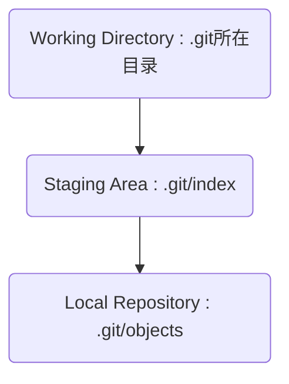

# git的使用
## 新建仓库

创建一个名为`name`的仓库(文件夹):
```bash
git init [name]
```

然后进入仓库可以看见一个`.git`隐藏文件

通过 `ls -Hidden` 查看隐藏文件

`cd .git` + `ls` 查看仓库配置


从某个路径下克隆一个仓库到本地:
```bash
git clone [path]
```

如 `git clone https://github.com/Errormecium/Git`

## 工作区域和文件状态



add: Working Directory 2 Staging Area

commit: Staging Area 2 Local Repository

## 添加和提交文件

`git status` 查看仓库状态：可以查看当前分支、untracked文件、toBeAdded文件:
```bash
git status
```

`git ls-files` 查看暂存区文件:
```bash
git ls-files
```

`git add` 把untracked文件添加到暂存区中:
```bash
# add file1.txt
git add file1.txt
# add all file with suffix txt
git add *.txt
# add all file
git .
```

`git commit` 只有暂存区中的文件才能commit进入local repo:
```bash
# commit the file with short log
git commit -m "commita"
# commit the file and write the log, after the cmd enter the vim to write log. :wq quit
git commit
```

`git log` 查看commit日志:
```bash
# check all commit log
git log
# check the commit log briefly
git log --oneline
```

## reset回退版本

```bash
git reset --arg [num]
```

|  参数   | 工作区  | 暂存区 |
|  ----  | ----  | ---- |
| --soft  | √ |  √  |
| --hard  | × |  ×  |
| --mixed  | √ |  ×  |

soft 就是回退到最后一次commit前

mixed 回退commit并且把最后一次commit的文件从暂存区拿走

hard 会把未跟踪的文件也删除了

如 `git reset --soft 9b3ad73`

`git reflog` 可以看见平时的状态用来撤回操作:
```bash
git reflog
```

## diff 查看差异

显示暂存区与工作区的差异:
```bash
git diff [file]
```

显示暂存区与上一次提交的差异:
```bash
git diff --staged [file]
# or
git diff --cached [file]
```

显示两次指定提交的差异:
```bash
it diff [first-branch]...[second-branch]
```

## 删除文件

查看文件状态:
```bash
# 查看工作区文件
ls
# 查看暂存区文件 --stage显示更详细的信息
git ls-files [--stage]
# 查看本地仓库文件 -r是将文件夹中的文件递归列出 --name-only是只显示文件名
git ls-tree [-r] HEAD [--name-only]
```

从工作区中删除文件，然后在暂存区追加更新该文件的工作区状态(暂存区中删除):
```bash
del [file]
git add [file]
```

工作区和暂存区同时删除该文件:
```bash
git rm [file]
```

把文件从暂存区删除，但保留在当前工作区中:
```bash
git rm --cached [file]
```

删除工作区和暂存区的文件后继续更新本地仓库使得仓库中文件也删除:
```bash
git rm [file]
git commit -m "[log content]"
```

## .gitignore文件
在与.git同级的根目录下创建`.gitignore`文件，添加文件名、通配符结合的文件名等，就可以使得指定文件被忽略，无法add和commit

注意生效前提是修改`.gitignore`时指定文件不被追踪，以及不在repo中

注意的是powershell使用echo会出现编码问题

这个是powershell下声控UTF-8字符编码的空.gitignore文件的命令:
```bash
"" | Out-File .gitignore -Encoding utf8
```

## ssh配置

本地仓库根目录生成ssh密钥:
```bash
# protocol:rsa size:4096
ssh-keygen -t rsa -b 4096
```

然后指定密钥文件名，输入密码，注意文件名不要和之前的重合否则覆盖不可逆

复制~.pub公钥文件的内容，github打开setting-SSH和GPG密钥，新建key并粘贴保存

克隆命令:
```bash
git clone [ssh]
```

推送命令:
```bash
git push
```

拉取更新内容:
```bash
git pull
```
## 分支简介和基本操作
查看分支图:
```bash
git log --oneline --graph --decorate --all
```

查看分支列表：
```bash
git branch
```

创建分支：
```bash
git branch <branch-name>
```

切换分支:
```bash
git switch <branch-name>
```

合并分支:
```bash
# 在某分支中使用该命令，则将指定的分支合并到当前分支中
git merge <branch-name>
```

删除分支:
```bash
# 已合并
git branch -d <branch-name>
# 未合并
git branch -D <branch-name>
```

一般提交信息用"main:1"表示这是main分支的第一次提交

## 解决合并冲突

两个分支修改了同一个文件的同一处位置时会产生冲突

解决方法：
- 手工修改冲突文件合并冲突内容
- 添加暂存区 add
- 提交修改 commit

commit后将会自动合并

如果想要中止合并，则使用:
```bash
git merge --abort
```
## rebase

嫁接分支:
```bash
## 会将main分支在两分支公共祖先后的部分嫁接到dev后
git switch main
git rebase dev
```